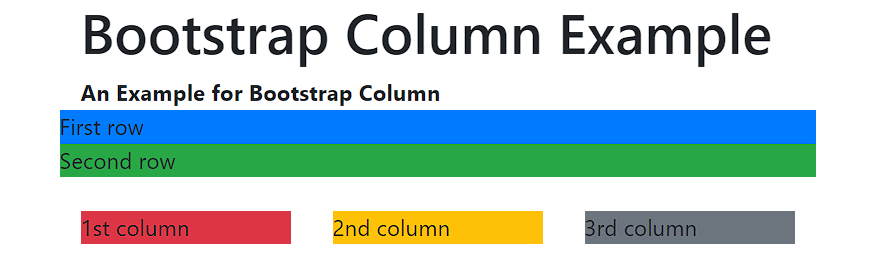
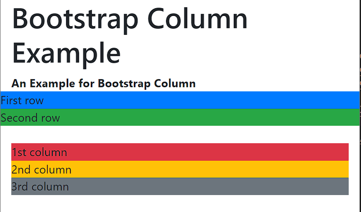
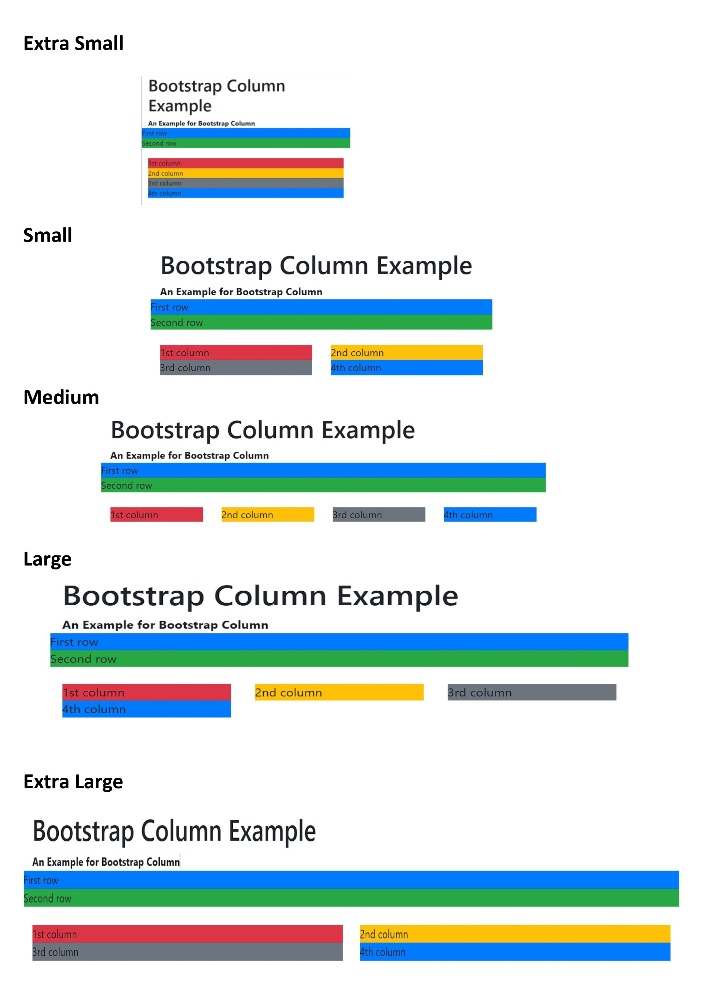

# Columns:
* In a grid layout, content must be placed within columns and only columns may be immediate children of rows.
* Grid columns without a specified width will automatically layout as equal width columns. For example, four instances of ```.col-sm``` will each automatically be 25% wide from the small breakpoint and up.
* Column classes indicate the number of columns you’d like to use out of the possible 12 per row. So, if you want three equal-width columns across, you can use ```.col-4```.
Column widths are set in percentages, so they’re always fluid and sized relative to their parent element.
Columns have horizontal padding to create the gutters between individual columns, however, you can remove the margin from rows and padding from columns with ```.no-gutters``` on the ```.row```.

<br />

## _**Syntax of 3 columns in a row:**_
```html
	<div class="container">
		<div class="row">
			<br />
				<div class="col-sm-4">
					<!--Content here-->
				</div>
				<div class="col-sm-4">
					<!--Content here-->
				</div>
				<div class="col-sm-4">
				    <!--Content here-->
				</div>
			</div>
		</div>
	</div>
```
<br />

## Example:


<br />

But for smaller devices like Mobiles portrait ```xs``` and landscape ```sm```, the columns would stack upon one another.

<br/>




 So, if we want the columns to stay in the same row, regardless of the size of the screen we must use ```xs```.
>But we can build even more dynamic and powerful layouts with using more than one choice for columns. 

Let’s say we define the attributes for columns as shown below.
```html
<div class="col-xs-2 col-sm-6 col-md-3 col-lg-5 col-xl-6">
```
## Output


<br /> 

[previous page>>](Rows.md)       <br /> 
[next page>>](Columns.md)