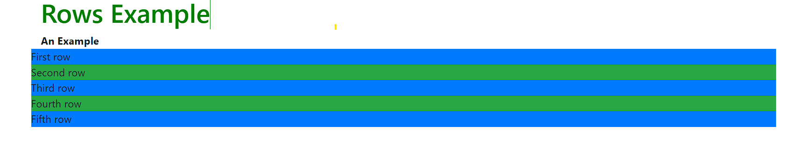

# Rows

>  We use rows to create horizontal groups of columns. Rows must be placed within a ‘container’ or ‘container-fluid’ for proper alignment and padding.

Syntax:

```html
<div class="container">
  <div class="row">
    <!--Content Here-->
  </div>
</div>
```
Example:


<br />
In a grid layout, content must be placed within columns and only columns may be immediate children of rows. 

[read more about Columns>>](Columns.md)

[previous page>](Containers.md)       <br /> 
[next page>>](Columns.md)

